# Estimation Project #

### Step 1: Sensor Noise ###
In this step, simulator is generated some noisy sensor data. Using notebook 
[Find_StdDev](
https://github.com/burkea/FCND-Estimation-CPP/blob/master/python/Find_StdDev.ipynb) calculate standart deviation of these sensor readings.

***Success criteria:*** *Your standard deviations should accurately capture the value of approximately 68% of the respective measurements.*

**Simulator Output:**

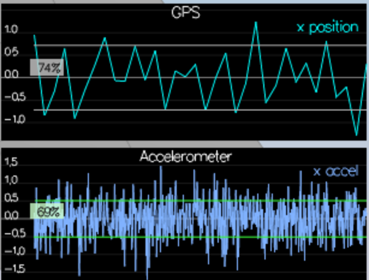

**Result:**

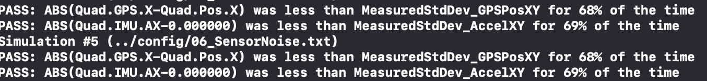


### Step 2: Attitude Estimation ###

In this scenario we need to include IMU measurements to the result state. We need a better integration method that using the current attitude estimate (rollEst, pitchEst and ekfState(6)) to integrate the body rates into new Euler angles

I've used class Quaternion<float> with and methods FromEuler123_RPY and IntegrateBodyRate methods to implement it.

***Success criteria:*** *Your attitude estimator needs to get within 0.1 rad for each of the Euler angles for at least 3 seconds.*

**Simulator Output:**

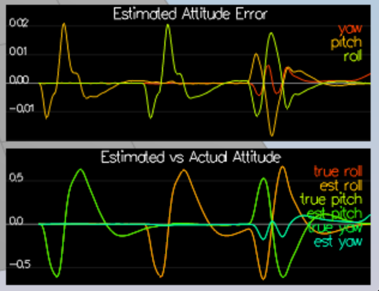

**Result:**


### Step 3: Prediction Step ###

Prediction can be break down into two parts: state mean and state covariance.

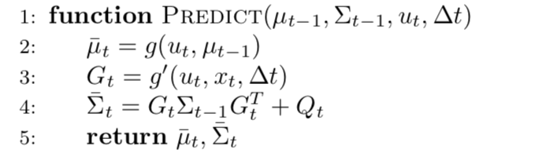
3.1: State Prediction
State transtion function as follows,
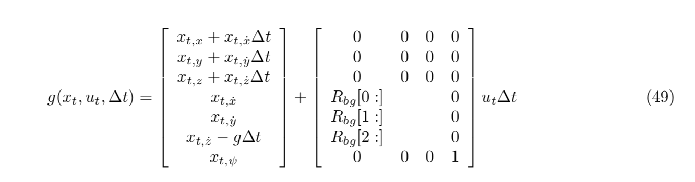
and Rotation matrix which is rotates body frame to global frame,
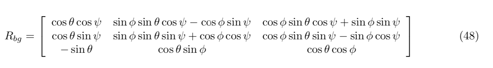

attitude.Rotate_BtoI(<V3F>) function is used to rotate accelaration body frame to global frame.


3.2: Covariance Prediction
We should took the Jacobian of g for linear approximation,
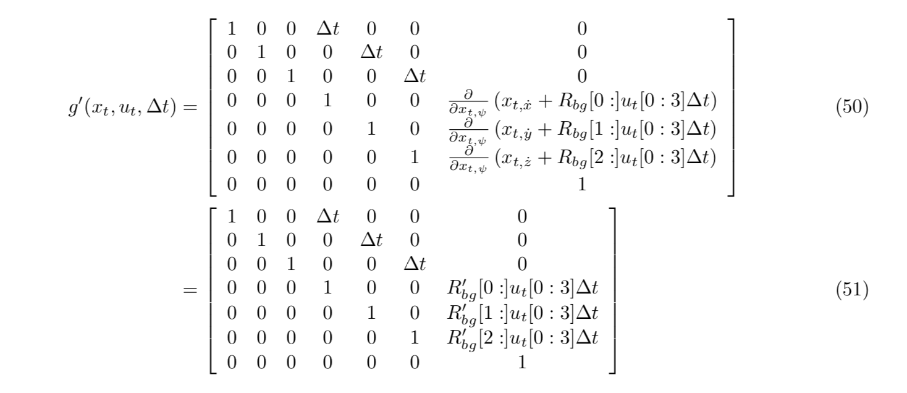

and rbg_prime will calculate as follows:
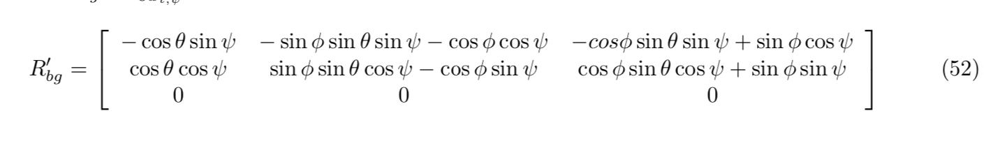

and take both the calculate state covariance.

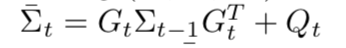


***Success criteria:*** *This step doesn't have any specific measurable criteria being checked.*


### Step 4: Magnetometer Update ###

In this step, the information from the magnetometer is added to improve filter's performance in estimating the vehicle's heading.

Magnetometer reports yaw in the global frame,
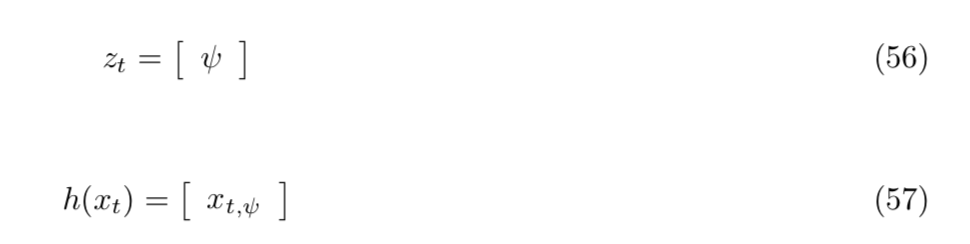
 since this is linear, the derivative is a matrix of zeros and ones.
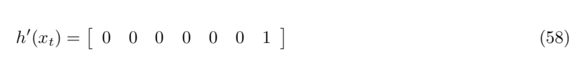

***Success criteria:*** *Your goal is to both have an estimated standard deviation that accurately captures the error and maintain an error of less than 0.1rad in heading for at least 10 seconds of the simulation.*

After implemeting ```UpdateFromMag``` function then I've tuned QYawStd parameter to .5 and get 
```
PASS: ABS(Quad.Est.E.Yaw-0.000000) was less than Quad.Est.S.Yaw for 82% of the time
```
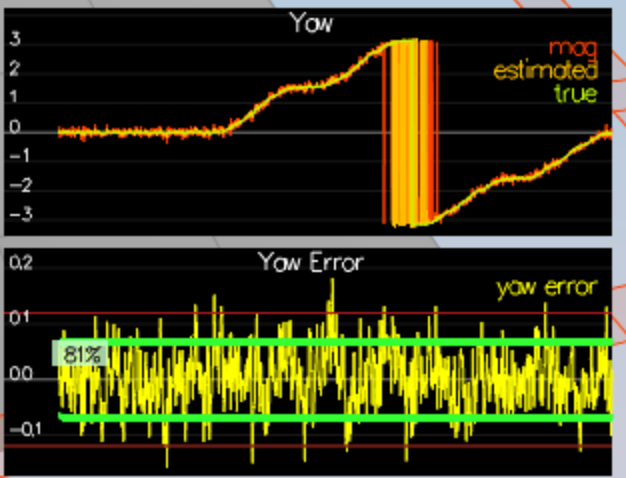

END OF STEP #2 -  @REMOVE_BEFORE_SUBMISSION
-----

### Step 5: Closed Loop + GPS Update ###

In this step, GPS update is implemented into estimator. position and velocity will get from GPS:

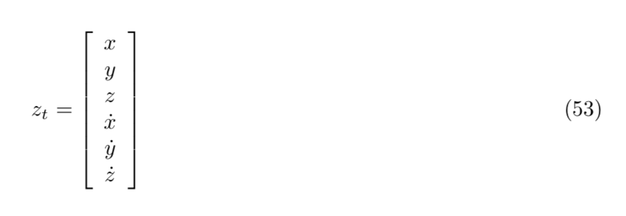
and our model is 

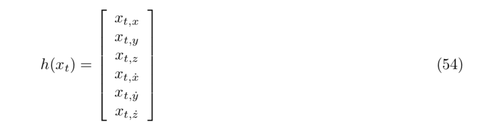

Then the partial derivative is the identity matrix:

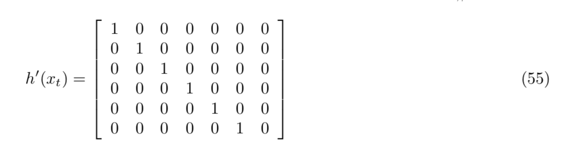


implementation can be found in ```UpdateFromGPS``` function.
***Success criteria:*** *Your objective is to complete the entire simulation cycle with estimated position error of < 1m.*

```
PASS: ABS(Quad.Est.E.Pos) was less than 1.000000 for at least 20.000000 seconds
```


### Step 6: Adding Your Controller ###

In this step, I've replaced QuadController.cpp and QuadControlParams.txt with my own code, then ran `11_GPSUpdate`

**Hint: you may find it easiest to do your de-tuning as a 2 step process by reverting to ideal sensors and de-tuning under those conditions first.**

***Success criteria:*** *Your objective is to complete the entire simulation cycle with estimated position error of < 1m.*

```
```


Up to this point, we have been working with a controller that has been relaxed to work with an estimated state instead of a real state.  So now, you will see how well your controller performs and de-tune your controller accordingly.

1. Replace `QuadController.cpp` with the controller you wrote in the last project.

2. Replace `QuadControlParams.txt` with the control parameters you came up with in the last project.

3. Run scenario `11_GPSUpdate`. If your controller crashes immediately do not panic. Flying from an estimated state (even with ideal sensors) is very different from flying with ideal pose. You may need to de-tune your controller. Decrease the position and velocity gains (we’ve seen about 30% detuning being effective) to stabilize it.  Your goal is to once again complete the entire simulation cycle with an estimated position error of < 1m.


# Estimation Project #


Welcome to the estimation project.  In this project, you will be developing the estimation portion of the controller used in the CPP simulator.  By the end of the project, your simulated quad will be flying with your estimator and your custom controller (from the previous project)!

This README is broken down into the following sections:


 - [Setup](#setup) - the environment and code setup required to get started and a brief overview of the project structure
 - [The Tasks](#the-tasks) - the tasks you will need to complete for the project
 - [Tips and Tricks](#tips-and-tricks) - some additional tips and tricks you may find useful along the way
 - [Submission](#submission) - overview of the requirements for your project submission


## Tips and Tricks ##

 - When it comes to transposing matrices, `.transposeInPlace()` is the function you want to use to transpose a matrix

 - The [Estimation for Quadrotors](https://www.overleaf.com/read/vymfngphcccj) document contains a helpful mathematical breakdown of the core elements on your estimator

## Submission ##

For this project, you will need to submit:

 - a completed estimator that meets the performance criteria for each of the steps by submitting:
   - `QuadEstimatorEKF.cpp`
   - `config/QuadEstimatorEKF.txt`

 - a re-tuned controller that, in conjunction with your tuned estimator, is capable of meeting the criteria laid out in Step 6 by submitting:
   - `QuadController.cpp`
   - `config/QuadControlParams.txt`

 - a write up addressing all the points of the rubric

## Authors ##

Thanks to Fotokite for the initial development of the project code and simulator.